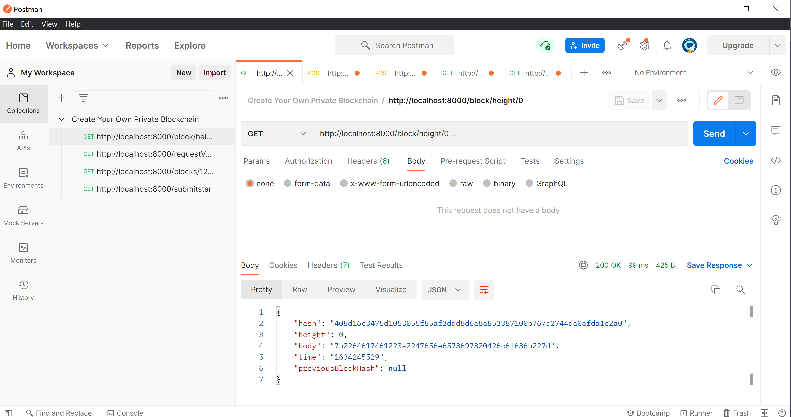
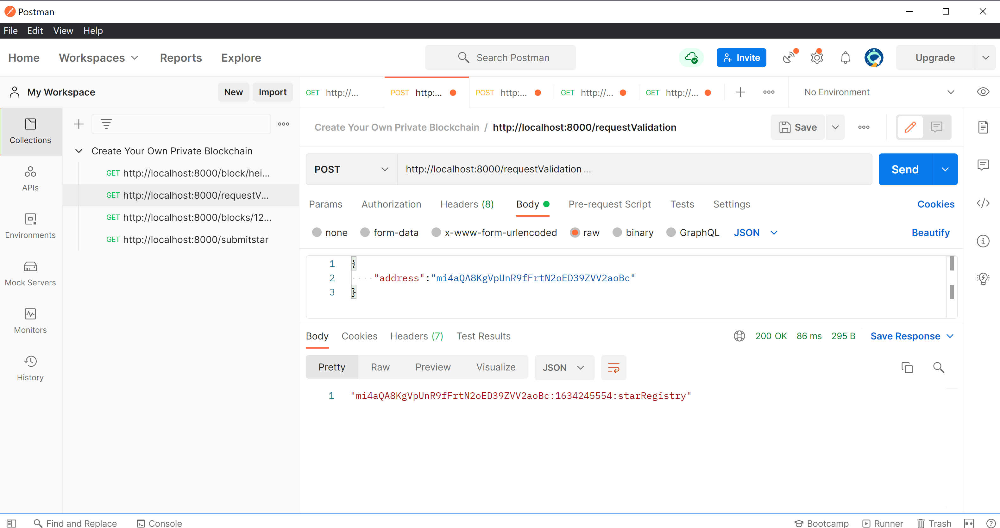
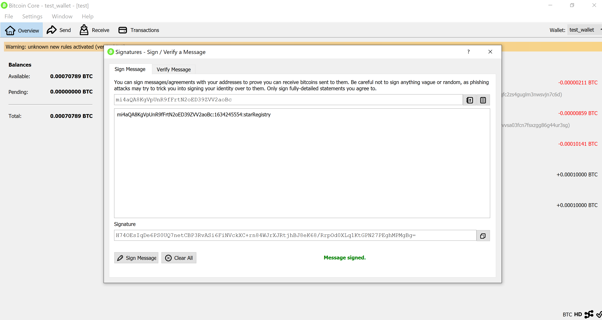
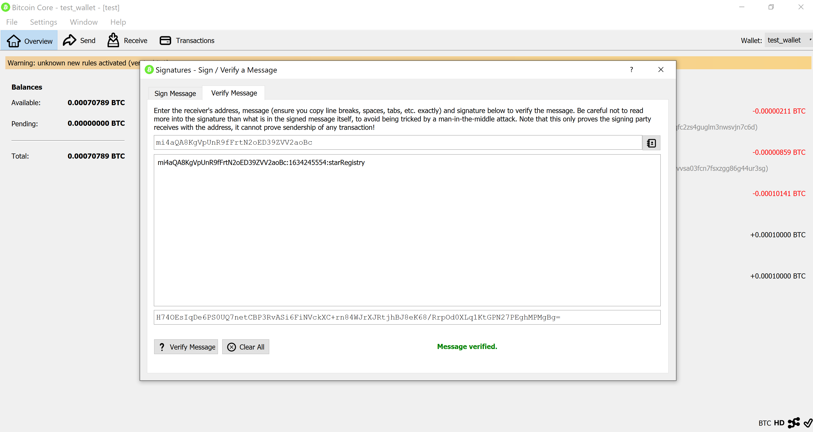
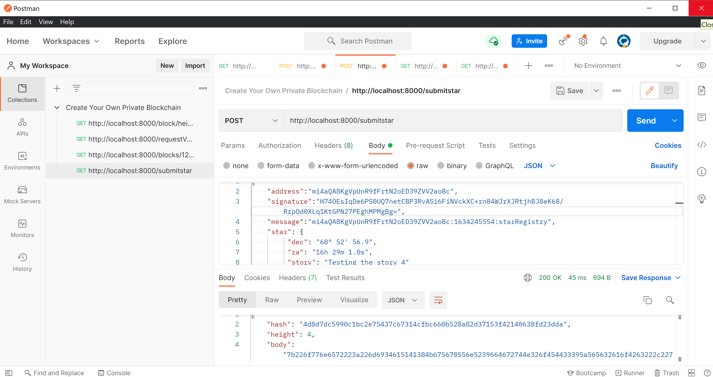
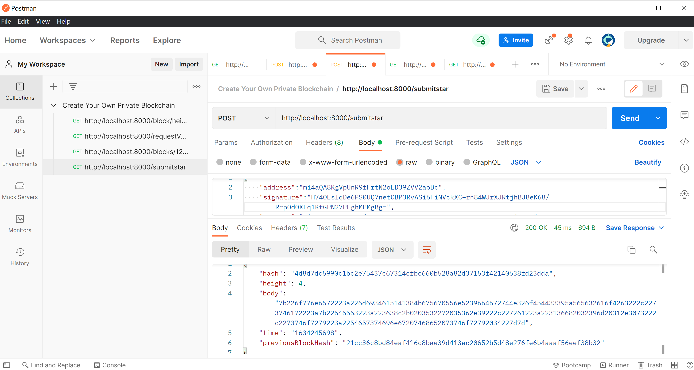
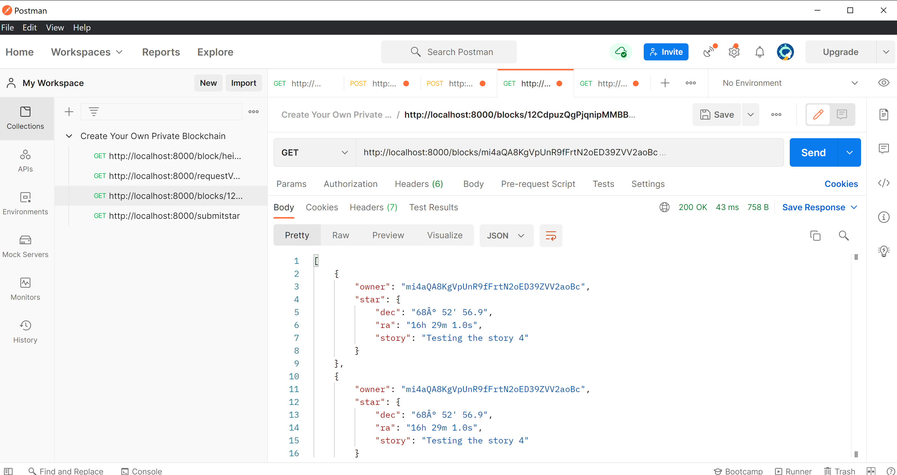
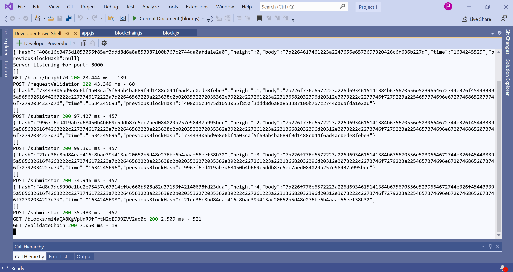

# Udacity Private Blockchain Application

#### This application allows to register the stars and it knows who own the star.

#### To run this application
 ```bash
     `node app.js`

    > Server Listening for port: 8000
    ```

#### The application will create a Genesis Block when we run the application.



#### The user will request the application to send a message to be signed using a Wallet and in this way verify the ownership over the wallet address. The message format will be: `<WALLET_ADRESS>:${new Date().getTime().toString().slice(0,-3)}:starRegistry`;



#### Sign the message with your Wallet:



#### Verify the message 



#### Submit the star





#### Retrieve Stars owned



#### Output


